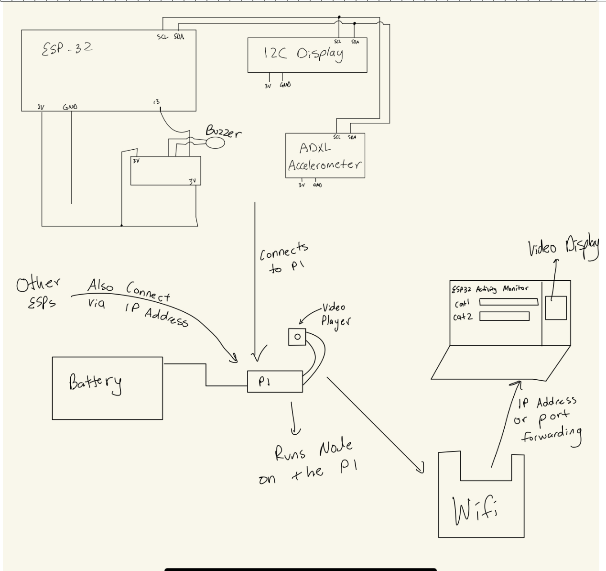
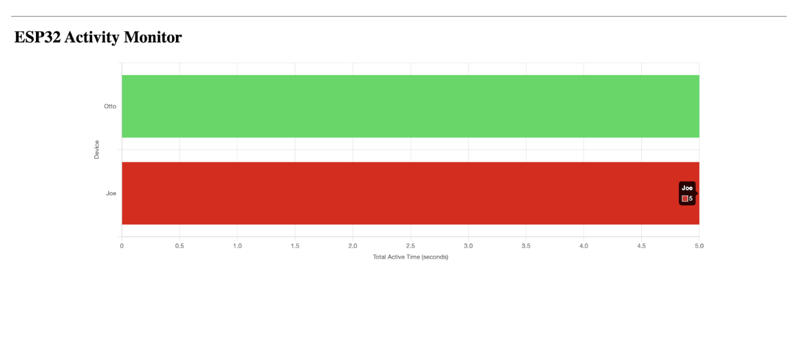
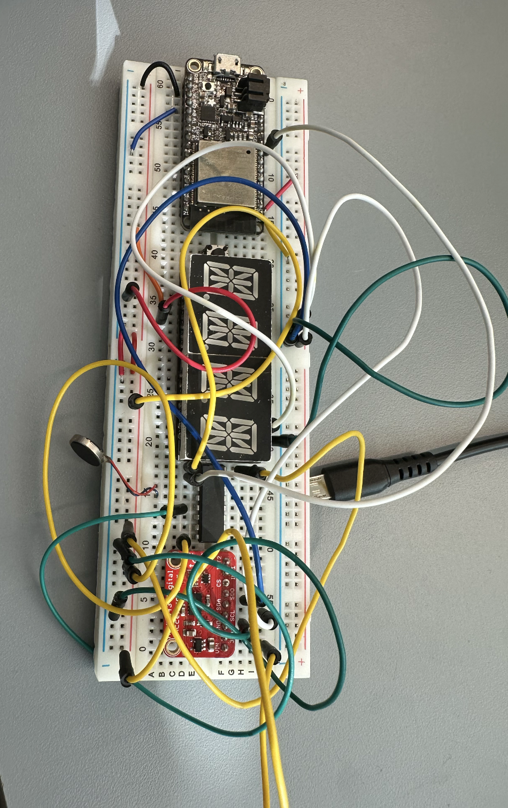
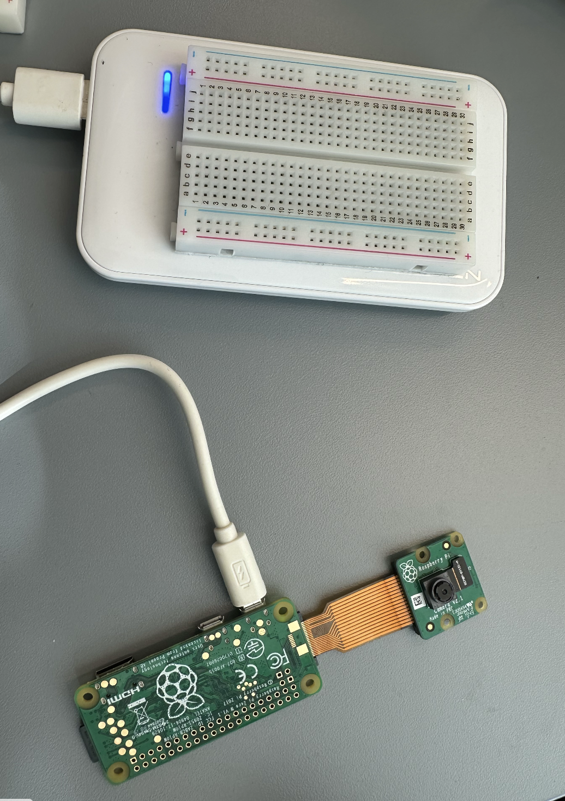

FitCat - ESP32

Authors: Yongjoon Kweon, Yena Yu, Howell Xia, Kevin Connell

Date: 10/25/24

### Summary
In this quest, we created a server for hosting data originating from multiple Cat Trackers. The goal is to wirelessly track the activity time for each connected Cat Tracker in one place and to send the activity leader back to the devices.

We continuously polled an accelerometer to calculate average acceleration. Based on the magnitude of the acceleration, the cat’s state is set at “INACTIVE”, “ACTIVE”, or “HIGHLY Active”, and the appropriate timer is incremented. The data and cat name is sent to a node.js server. The server calculates the current leader and sends the leader’s name as a response. The Cat Trackers each buzz if there is a new leader. Additionally, the server sends the data to a front-end html page, which graphs the timer for each Cat Tracker.

Circuit and graph of how connections between esp32 and node server and graph work

### Solution Design

The device… 
Reads from an ADXL343 accelerometer from I2C pins (SDA and SCL)
Calculates average magnitude of acceleration
Counts the number of seconds spent in the active and highly active states
Output the name of the leader of the “cats” to an Adafruit 14-Segment Alphanumeric LED via the I2C pins (SDA and SCL).
Sends data to the Raspberry Pi ip address in the form of “Time Name” so that the node file can read the name of the cat and also the time spent in the active/highly active states
Receives data from the node file (the time spent in the active state's leader) in the form of a string. This string will be the name of the time “leader” at that moment.
This data is written to the LED
This data is also compared to the previous leader and buzzes the buzzer if the leader has changed

The Node.js and Index.html…
Receives data from each device with its name and activity timer. 
Calculates the current leader and sends the leader’s name as a response to each device
Displays the live data in a bar graph form

Live Bar Graph

### Quest Summary

We were able to create a working demonstration of an online Cat Tracker web server that displays and tracks multiple cats’ activity levels that interacts with the hardware of our collars to update and display the activity leader. This web server run over a raspberry pi demonstrates the application and utility of IoT devices. 

We managed to successfully connect our cat trackers from the previous quest via wifi and send data to our web server running on a pi accessible over the open internet. Our browser then displayed the activity state of our cats and charted their activity over a 10 minute window and displayed a video output to a video player. Finally the leaderboard data is then interpreted and sent back to the ESP32s to update the LED display and activate a buzzer upon a leader change.

Activation and Behavior: The collar primarily measures the acceleration of the cat in realtime to relay to the owner whether their cat is in a state of inactivity, activity, or high activity. The owner is then able to see how long their pet was in each state and what time of the day they were active. The system also tracks the pets temperature and other sensors could easily be integrated into a final product.

Sensor Data:
Acceleration recorded to determine pet’s activity level
LED display to convey the following information
“Leader is” + name of cat with the longest time spent in the active/highly active states
Buzzer to buzz when the leader has changed
Data is sent and displayed through a graphical interface

Cat Tracker

RaspberryPi

### Challenges

One challenge we faced was connecting multiple ESP32s to our Raspberry Pi. We realized that our code had to communicate between our server (PI) and our ESPs. To ensure seamless communication, we had to undergo testing locally and multiple print statements to make sure the esp received messages from our node file, and the node file received data from our ESP32s. 

In addition, we had many issues with traffic in our Raspberry Pi. When we connected and ran our video module on the node file to display on our laptops, the node file would significantly decrease in quality and ability to run. Due to the amount of space and power that the video player took, it was difficult to run both the video player and the node module at the same time. The Raspberry Pi would become extremely hot and end up losing a lot of functionality.

### Supporting Artifacts

- 

<i> Technical Presentation Video</i>

<i> Demo Video</i>

